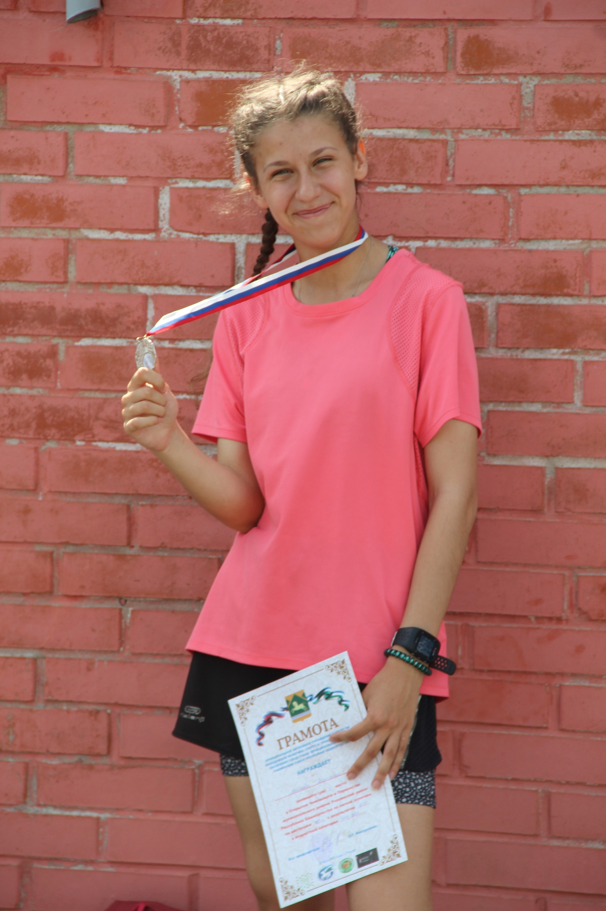

# -NastyaPlus-.github.io
# Привет, меня зовут Анастасия

## Обо мне
Я студенка 3 курса. Помимо учебы в университете занимаюсь легкой атлетикой. Люблю читать книги и активно провожу свободное время. 

## Мои достижения
- Призер республики Башкортостан
- В 2021 году завоевала серебро на Первенстве ПФО U20 (2002-2003)
- Личный рекорд на дистанции 1 км - 3.00.
- Принимала участие в соревнованиях Первенства и Чемпионата России по легкой атлетике.

## Благодарности
Спасибо, что уделили внимание моему профилю! 

